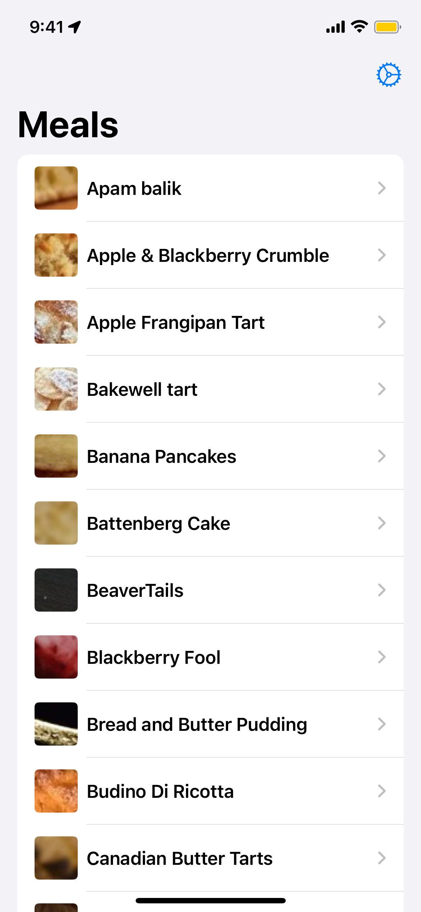
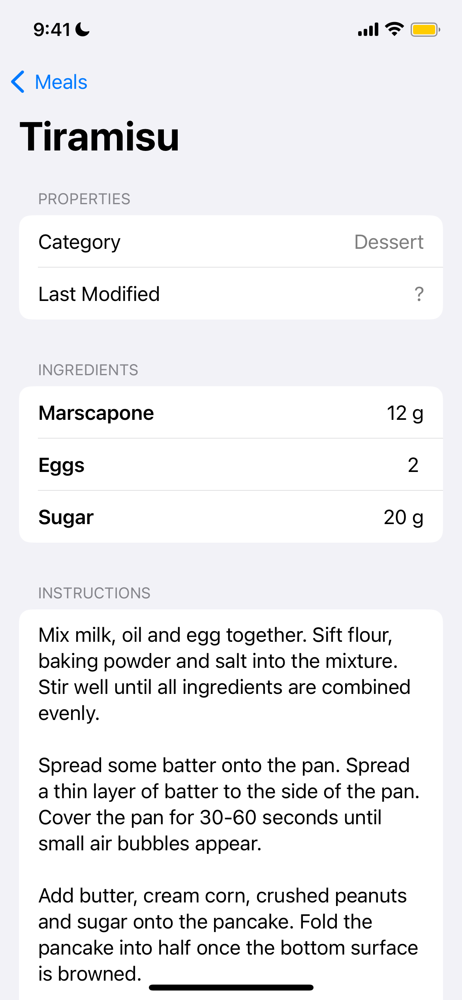

# FetchRecipe

_A simple recipe browser._

| List | Detail |
|---|---|
|||

## Architecture

The app is organized into separate SPM modules:
- Core
- UI
- Domain
- Network

(It's overkill for a simple app, but gives a nice template to expand on in future projects.)

I use a composable-esque architecture, with a central `Store` and a `Service` layer to abstract the `DTO -> Model` conversion. Each view owns and contains the data it needs, and shared data (exemplified with `[Meal]`) put in the `Store`.

Other misc features:
- Debug menu with two environments: `prod`, and `mock`
- `AppLogger` using OSLog
- A cute wrapper around URLSession/URLResponse, and for ResponseCode semantics
- One (1) dependency: Kingfisher
- Fixed the messy backend return of 40 parameters (!) for ingredient steps / measurements into a nicer array; see [MealInfo.swift](FetchRecipeDomain/Sources/Real/MealInfo.swift) for the conversion
